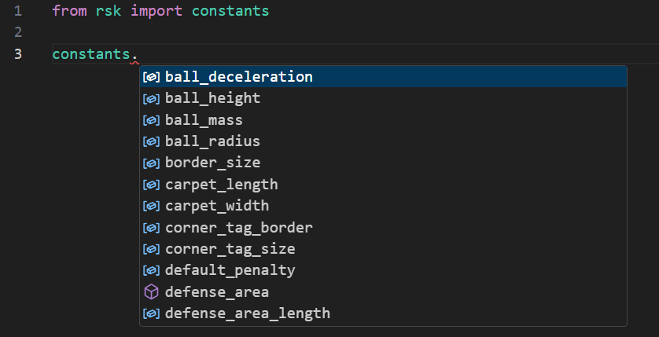

# Robot Soccer Kit - Programme ton robot footballeur

## Introduction

Dans ce projet, vous allez apprendre à programmer des robots omnidirectionnels (qui peuvent se déplacer dans toutes les directions) afin qu'ils jouent au football.

## Appréhension de l'environnement de programmation et du kit

### Lancement du simulateur

Pour lancer le simulateur, il suffit de double cliquer sur l'icône  sur le Bureau.

Une autre possibilité est de lancer la commande suivante dans un terminal  :

```bash
python -m rsk.game_controller -s
```

Cela ouvrira une fenêtre de simulation dans un navigateur avec un terrain de football, quatre robots, une balle ainsi que l'interface d'arbitrage telle que présentée ci-dessous.


Si vous fermez le navigateur par inadvertance, l'interface reste accessible en réouvrant le navigateur et en allant à l'adresse [`http://127.0.0.1:7070`](http://127.0.0.1:7070).

### Lancement de l'interface de programmation

Dans ce tutoriel, nous allons utiliser Visual Studio Code afin de programmer les robots grâce à Python.

1. Ouvrez Visual Studio Code en double cliquant sur l'icône  sur le Bureau.

2. Ouvrez le dossier où se trouvent tous les programmes du projet en cliquant sur `Fichier` puis `Ouvrir Dossier...` et en sélectionnant le dossier `Programmes-RobotSoccerKits` sur le Bureau.

### Création d'un nouveau fichier

Pour créer un nouveau fichier, il suffit de faire un clic droit dans la zone à gauche, sur le dossier Code, et de cliquer sur `New File...`, puis d'entrer le nom du fichier, en le terminant par .py, car nous programmons ici en Python.


Si la zone n'apparait pas, cliquer sur l'icone : 

### Lancement d'un programme

Pour lancer un programme, cliquer sur le petit triangle play encadré en rouge ci-dessous :


Une fenêtre de terminal apparait alors en bas de l'écran.


### Arrêter un programme

Enfin pour couper un programme, cliquer sur la petite poubelle (entourée en rouge ci-dessous) dans la partie terminal


## Introduction à la programmation des robots

## Première partie : Implémentation d'un robot défenseur

### Objectif

Le but de cette première partie est de programmer un robot défenseur qui doit empêcher l'équipe adverse de marquer un but.

### 1. Suivi de la balle en Y

Voici un exemple de code permettant de faire en sorte que le robot Green1 suive la balle selon l'axe x.

```python
import numpy as np
import math
import rsk

client = rsk.Client() #Crée un client Robot Soccer Kit, contenant nombre de variables utiles 

while(1):#Boucle infinie permettant d'actualiser l'ordre demandé
    client.green1.goto((client.ball[0], 0.0, math.radians(-90)))#Déplace le robot Green1 à la position actuelle de la balle selon l'axe x, en restant sur la droite où y = 0, et oriente le robot vers le bas
```

Pour information,

La fonction `client.green1.goto()` prend 3 arguments :

- la position en x (ici `client.ball[0]` )
- la position en y (ici `0.0` )
- l'orientation (ici `math.radians(-90)`, c'est-à-dire orienté vers le bas)

On peut remarquer que l'on utilise la fonction math.radians() afin de convertir une valeur en degré en valeur en radian.
Pour utiliser cette fonction, nous avons besoin de la bibliothèque math, que l'on importe ligne 2 avec `import math`


De plus,

- `client.ball[0]` correspond à la position de la balle en x

- `client.ball[1]` correspond à la position de la balle en y

La première étape est de réussir à suivre la balle selon l'axe y, de manière à bloquer un éventuel tir ennemi.

1. Modifier les arguments de la fonction `client.green1.goto()` afin de suivre la balle selon l'axe y, en restant sur la ligne médiane (c'est-à-dire la droite où x = 0).

On peut alors remarquer une latence entre le moment où la balle bouge et le moment où le robot bouge.
Cela est dû au caractère blocant de la fonction goto(). En effet, la fonction `goto()`, sans l'argument `wait=False`, est une fonction blocante, ce qui signifie qu'elle bloque le programme jusqu'à être réalisée, même si la balle n'est plus à la position demandée. Donc, lorsqu'on utilise la fonction `goto()` sans argument `wait=False`, le robot aura toujours un temps de retard : il va toujours se déplacer vers l'ancienne position de la balle.

Voici l'exemple initial, en ajoutant l'argument `wait=False` :
```python
import numpy as np
import math
import rsk

client = rsk.Client() #Crée un client Robot Soccer Kit, contenant nombre de variables utiles 

while(1):#Boucle infinie permettant d'actualiser l'ordre demandé
    client.green1.goto((client.ball[0], 0.0, math.radians(-90)),wait=False)#Déplace le robot Green1 à la position actuelle de la balle selon l'axe x, en restant sur la droite où y = 0, et oriente le robot vers le bas
```

2. Ajouter l'argument `wait=False` aux arguments de la fonction `client.green1.goto()` du programme fait au 1. afin de régler ce problème.

Enfin, de nombreuses constantes ont été définies de manière à simplifier le développement sur RSK.
On les retrouve dans la sous-bibliothèque constants de la bibliothèque RSK.
Pour les importer, il suffit d'utiliser : `from rsk import constants`

La liste des constantes déjà implémentées est disponible ici : https://github.com/robot-soccer-kit/robot-soccer-kit/blob/master/rsk/constants.py 

Une fois la bibliothèque implémentée avec `from rsk import constants`, on peut également retrouver ses différentes constantes et fonctions sur VSCode en tapant `constants.`


3. L'étape suivante sera de faire suivre la balle au robot en y, tout en suivant la ligne de but (c'est-à-dire la droite où x = `constants.field_length/2`).


### 2. Rester dans les cages

On aimerait désormais que le robot défenseur ne quitte pas la zone du gardien et reste entre ses poteaux.

Pour cela, nous allons venir vérifier qu'il ne sort pas des buts à l'aide d'une instruction conditionnelle (On demande au robot de faire quelque chose SI une condition est vérifiée).
Nous allons donc utiliser une instruction de type IF/ELIF/ELSE (cf. la partie **Conditions et Boucles** du *Memo Python* pour plus d'explications)

En voici un exemple, complétant l'exemple précédent, permettant d'empêcher le robot de sortir de son coté du terrain :

```python
import rsk
import math

client = rsk.Client() #Crée un client Robot Soccer Kit, contenant nombre de variables utiles 

while(1): #Boucle infinie permettant d'actualiser l'ordre demandé
    if client.ball[0] > 0.0: #Si la balle est dans la zone de l'équipe verte
        client.green1.goto((client.ball[0], 0.0, math.radians(-90)), wait=False) #Déplace le robot Green1 à la position actuelle de la balle selon l'axe x, et oriente le robot vers le bas
    else: #Sinon
        client.green1.goto((0.5, 0.0, math.radians(-90)), wait=False)#Déplace le robot Green1 à la position [0.5,0.0], et oriente le robot vers le bas
```

Il est également possible de ne pas mettre de `else`, le robot ne fera alors rien si la condition n'est pas remplie (Il restera à sa position)

```python
import rsk
import math

client = rsk.Client() #Crée un client Robot Soccer Kit, contenant nombre de variables utiles 

while(1):#Boucle infinie permettant d'actualiser l'ordre demandé
    if client.ball[0] > 0.0: #Si la balle est dans la zone de l'équipe verte
        client.green1.goto((client.ball[0], 0.0, math.radians(-90)),wait=False)#Déplace le robot Green1 à la position actuelle de la balle selon l'axe x, et oriente le robot vers le bas
```

Nous aimerions donc que le robot ne sorte pas de sa ligne de gardien, en restant entre le poteau haut (`y = constants.goal_width/2`) et le poteau bas (`y = -constants.goal_width/2`)

1. Adapter le code de suivi de la balle en Y pour empêcher le robot de sortir des buts.

### 3. BONUS : Intersectionner la trajectoire de l'attaquant

Nous avons désormais un gardien basique, qui reste dans ses cages, capable d'arrêter les tirs horizontaux.

Cependant, il est possible que l'attaquant fasse des tirs diagonaux, qui seront difficilement arrêtés par notre gardien actuel.

La solution devient alors de placer le robot dans la trajectoire de l'attaquant.

Pour se faire, il faut réussir à le placer sur la droite passant par l'attaquant et la balle.

En manipulant la géométrie, on obtient :

$y_{defenseur} = \frac{(y_{attaquant} - y_{balle})}{(x_{attaquant} - x_{balle})} \times x_{defenseur} + y_{balle}$

Ne reste alors qu'une dernière étape :

1. Modifier la fonction précédente afin de déplacer le robot à l'intersection entre la trajectoire de l'attaquant et la ligne de but. Un exemple de code à compléter vous est également proposé ci-dessous.

```python
import numpy as np
import math
import rsk

from rsk import constants

client = rsk.Client() #Crée un client Robot Soccer Kit, contenant nombre de variables utiles 

while(1):#Boucle infinie permettant d'actualiser l'ordre demandé
    xb1 = client.blue1.position[0]
    yb1 = client.blue1.position[1]

    xballe = client.ball[0]
    yballe = client.ball[1]
    if xballe > xb1: #Si l'attaquant est plus avancé que la balle, il ne peut pas tirer, donc pas besoin de se déplacer
        pente = (yb1-yballe)/(xb1-xballe)

        xg1 = constants.field_length/2
        yg1 = ...
        
        if yg1 > ... :
            client.green1.goto((xg1, constants.goal_width/2, math.radians(180)),wait=False)#Déplace le robot Green1 à son poteaux haut, et oriente le robot vers la gauche
        elif yg1 < -... :
            client.green1.goto((xg1, -constants.goal_width/2, math.radians(180)),wait=False)#Déplace le robot Green1 à son poteaux bas, et oriente le robot vers la gauche
        else:
            client.green1.goto((xg1, yg1, math.radians(180)),wait=False)#Déplace le robot Green1 à la position actuelle de la balle selon l'axe y, et oriente le robot vers la gauche
```

### Conclusion Partie Défenseur

Nous avons désormais un gardien coté vert capable de défendre notre but face à l'attaquant blue1.

Cependant, plusieurs problèmes subsistent :

- notre gardien n'est pas programmé pour défendre contre l'autre joueur bleu.

- nous n'avons pas de stratégie de contre-attaque pas.

On pourrait également implémenter des stratégies à deux joueurs, pour faire des passes, et faire sortir le gardien de sa ligne de but, afin d'aller chercher la balle.

Toute ces problématiques n'entrent pas dans le cadre de cet atelier, dont le but est de proposer une introduction à la programmation Python avec RSK, mais pourront être adressées par les plus dévoués.

## Deuxième partie : Implémentation d'un robot attaquant

### Objectif

Dans cette seconde partie, nous allons programmer un robot attaquant qui doit tenter de marquer des buts.

Afin de pouvoir jouer contre notre robot défenseur, nous allons maintenant nous placer du coté bleu mais on pourrait également implémenter cet attaquant coté vert.

### 1. Attaque face aux cages

Pour commencer, nous allons implémenter un tir horizontal face aux cages.

Voici un exemple de code permettant de tirer vers le bas :

```python
import numpy as np
import math
import rsk
from rsk import constants

client = rsk.Client() #Crée un client Robot Soccer Kit, contenant nombre de variables utiles 

while(1):#Boucle infinie permettant d'actualiser l'ordre demandé    
    client.blue1.goto((client.ball[0], client.ball[1]+constants.robot_radius, math.radians(-90)))#Déplace le robot derrière la balle, orienté vers le bas
    client.blue1.kick() #Tire
```

On remarquera l'absence de l'argument `wait=False`, car on souhaite que le robot finisse son déplacement avant de tirer.

(On aurait également pu augmenter la réactivité de l'attaquant en mettant l'argument `wait=False` et en venant vérifier la distance entre le robot et la balle, mais pour des raisons de simplicité, nous ne metterons juste pas l'argument `wait=False`)

1. Modifier les arguments de la fonction `client.blue1.goto()` afin de se placer et s'orienter pour tirer vers les cages vertes (c'est-à-dire à gauche de la balle, orienté à 0°)

### 2. Tir vers les buts selon 3 couloirs

Nous avons maintenant un robot attaquant capable de tirer de manière horizontale.
Cependant, si le robot n'est pas aligné avec les cages, le tir ne sera pas cadré.

Pour régler ce problème, nous devons implémenter des tirs diagonaux.

Pour commencer, nous allons implémenter 3 différents tirs :

- un tir à -45° si nous sommes au dessus des cages (ci-dessous en rouge)
- un tir à 0° si nous sommes en face des cages (ci-dessous en jaune)
- un tir à 45° si nous sommes en dessous des cages (ci-dessous en bleu)


Pour se faire nous allons commencer par faire une distinction de cas avec des instructions IF/ELIF/ELSE comme dans la partie 2 du robot défenseur.

Puis, selon le cas nous choisirons le tir le plus adapté.

1. Compléter le code ci-dessous

```python
import numpy as np
import math
import rsk
from rsk import constants

client = rsk.Client() #Crée un client Robot Soccer Kit, contenant nombre de variables utiles 

while(1):#Boucle infinie permettant d'actualiser l'ordre demandé    
    if client.ball[1] > constants.goal_width/2: # Si la balle est au dessus du but
        orientation = ...
        client.blue1.goto((client.ball[0]-constants.robot_radius*math.cos(orientation), client.ball[1]-constants.robot_radius*math.sin(orientation), math.radians(orientation)))#Déplace le robot derrière la balle, orienté à orientation°
    elif client.ball[1] < -constants.goal_width/2: # Si la balle est en dessous du but
        orientation = ...
        client.blue1.goto((client.ball[0]-constants.robot_radius*math.cos(orientation), client.ball[1]-constants.robot_radius*math.sin(orientation), math.radians(orientation)))#Déplace le robot derrière la balle, orienté à orientation°
    else:
        orientation = ...
        client.blue1.goto((client.ball[0]-constants.robot_radius*math.cos(orientation), client.ball[1]-constants.robot_radius*math.sin(orientation), math.radians(orientation)))#Déplace le robot derrière la balle, orienté à orientation°
    client.blue1.kick() #Tire
```

### 3. Tir vers les but de manière continue (selon une infinité de couloirs)

Notre robot peut maintenant tirer selon 3 couloirs.
Mais pourquoi se limiter à 3 couloirs, on pourrait le faire tirer selon n'importe quelle orientation.

Pour cela, nous allons implémenter l'orientation de manière continue.

Où que soit le robot sur le terrain, nous allons le faire tirer vers le milieu des cages.

Pour se faire, un peu de trigonométrie nous donne :

$orientation = arctan(\frac{(y_{but} - y_{balle})}{(x_{but} - x_{balle})})$

Ne reste alors qu'à implémenter cela.

1. Compléter le code ci-dessous

```python
import numpy as np
import math
import rsk
from rsk import constants

client = rsk.Client() #Crée un client Robot Soccer Kit, contenant nombre de variables utiles 

while(1):#Boucle infinie permettant d'actualiser l'ordre demandé    
    #Position du milieu des buts [constants.field_length/2 ; 0.0]
    #La fonction arctan est disponible dans la bibliothèque math, en utilisant la fonction math.atan()

    orientation = math.atan(...)
    client.blue1.goto((client.ball[0]-constants.robot_radius*math.cos(orientation), client.ball[1]-constants.robot_radius*math.sin(orientation), orientation))#Déplace le robot derrière la balle, orienté à orientation°
    client.blue1.kick() #Tire
```

### Conclusion Partie Attaquant

Nous avons donc maintenant un attaquant capable de tirer selon une infinité d'angles.

Des problèmes persistent néanmoins :

- L'attaquant tire toujours au milieu des cages, la défense est donc aisé, un plot placé au milieu des cages suffirait pour défendre.
- Le robot n'évite pas la balle lorsqu'il se place, et peut potentiellement la déplacer par inadvertance.

Nous pourrions également programmer des stratégies permettant de faire des passes afin de déstabiliser l'équipe adverse.

Ces problématiques ne sont pas dans le cadre de cet atelier, mais pourront être adressées par les plus dévoués.

## Conclusion

Nous avons donc programmé les RSK de manière à avoir un attaquant bleu et un défenseur vert.

En modifiant légèrement le code, nous pourrions avoir une équipe composé d'un attaquant et d'un défenseur et faire des matchs.

De nombreuses problématiques n'ont pas été résolues lors de cet atelier, dont le but était l'introduction à RSK, et sont laissées en exercice à ceux qui le veulent.


