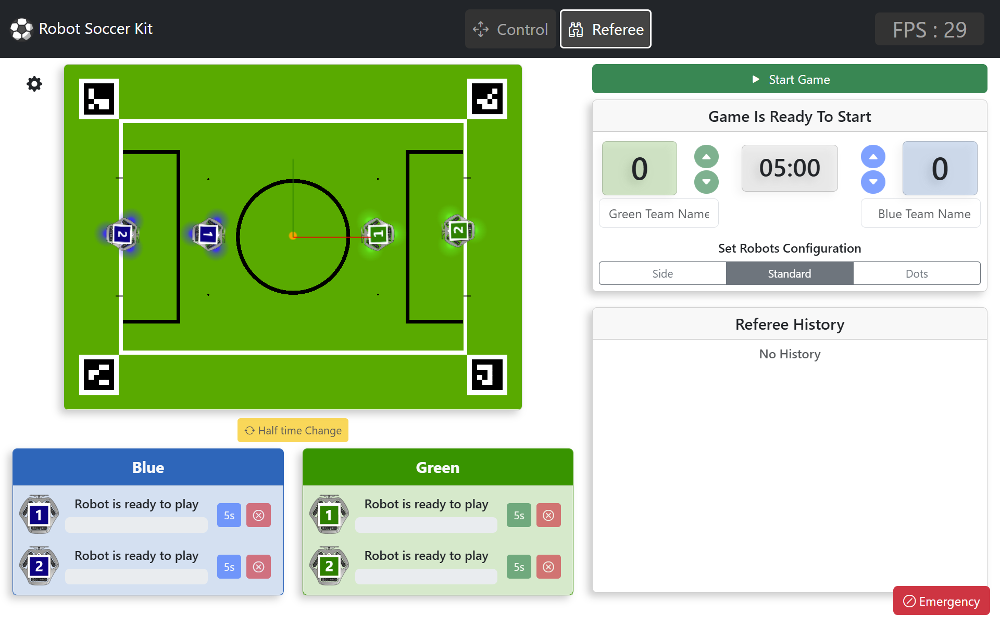
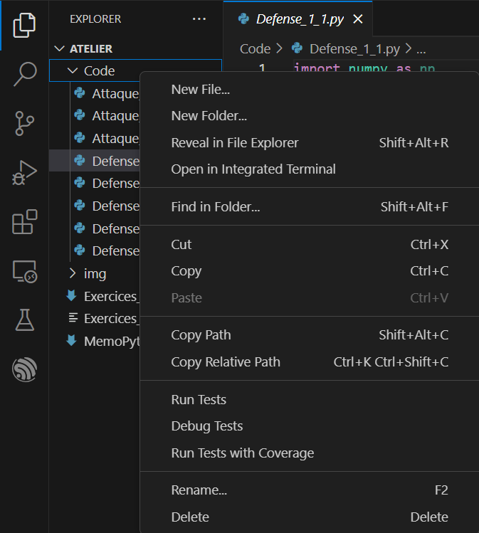
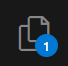
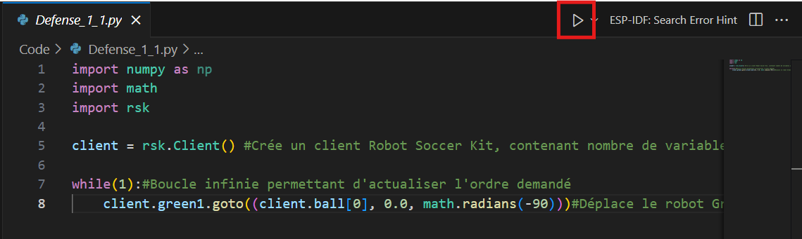
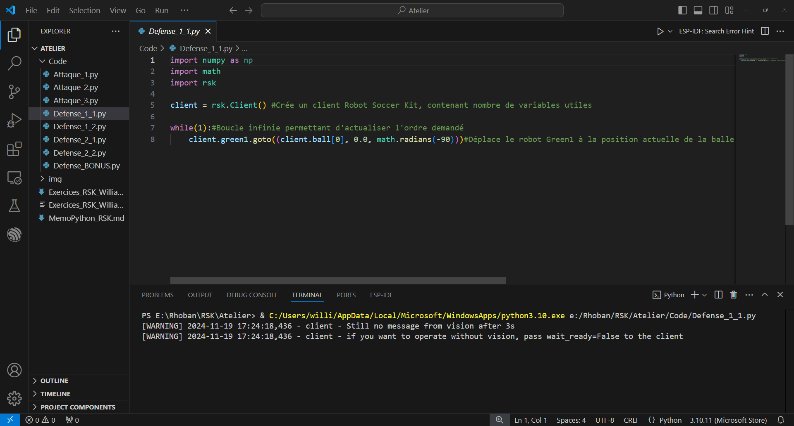
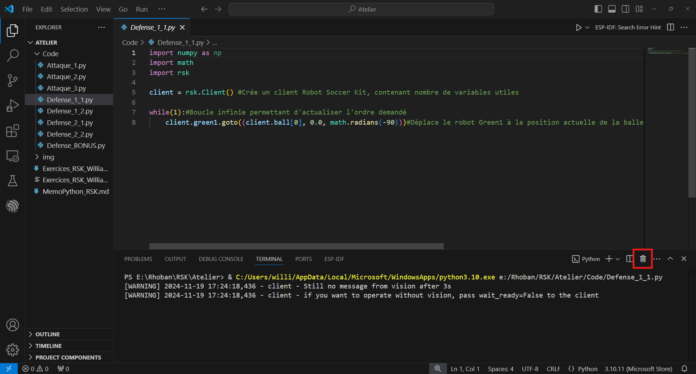
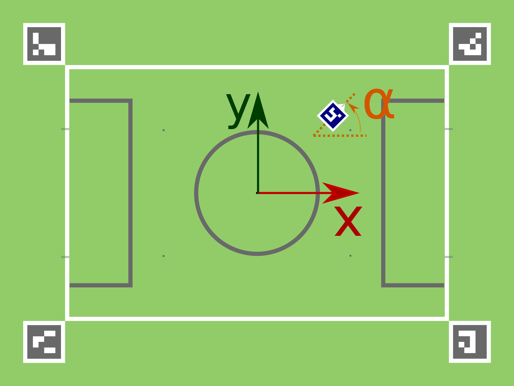
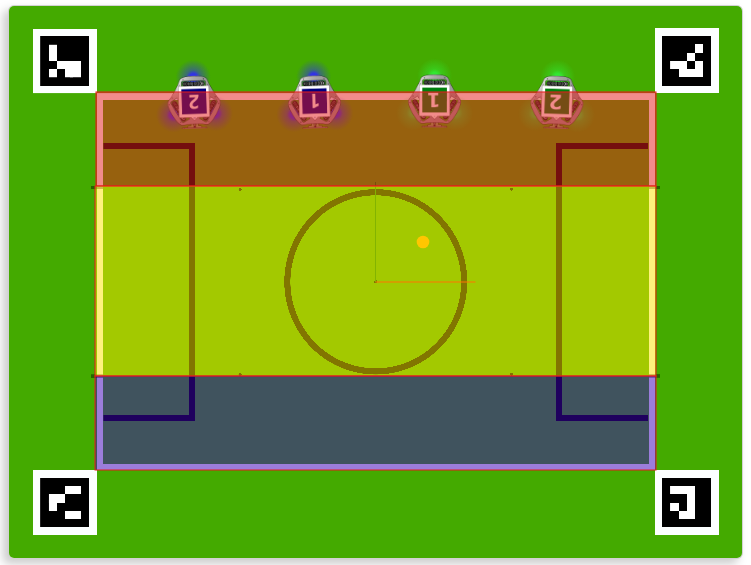
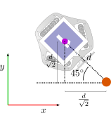

# Atelier Robot Soccer Kit - Programme ton robot footballeur

## Introduction

Dans cet atelier, vous allez apprendre à programmer des robots omnidirectionnels (qui peuvent se déplacer dans toutes les directions) afin qu'ils jouent au football.

## Prise en main de l'environnement de programmation

### Lancement du simulateur

Pour lancer le simulateur, cliquez sur l'icône  sur le Bureau.


Cela ouvrira une fenêtre de simulation dans un navigateur avec un terrain de football, quatre robots, une balle ainsi que l'interface d'arbitrage telle que présentée ci-dessous:



Si vous fermez le navigateur par inadvertance, l'interface reste accessible en réouvrant le navigateur et en allant à l'adresse [`http://127.0.0.1:7070`](http://127.0.0.1:7070).

### Interface de programmation

Vous vous trouvez actuellement dans *Visual Studio Code*, un éditeur de texte que nous allons utiliser pour programmer en *Python*.

### Création d'un nouveau fichier

Pour créer un nouveau fichier, il suffit de faire un clic droit dans la zone à gauche, sur le dossier Code, et de cliquer sur `New File...`, puis d'entrer le nom du fichier, avec l'extension `.py`, car nous programmons ici en Python.



Si la zone n'apparait pas, cliquer sur l'icone : 

### Lancement d'un programme

Pour lancer un programme, cliquer sur le bouton suivant:



Une fenêtre de terminal apparaît alors en bas de l'écran.



### Arrêter un programme

Enfin pour couper un programme, cliquer sur la petite poubelle (entourée en rouge ci-dessous) dans la partie terminal



## Système de coordonnées

Par la suite, nous utiliserons le système de coordonnées suivant:

 

* $x$ et $y$ sont les positions (exprimées en mètres)
* $\alpha$ est une orientation (exprimée en radians)
* l'origine du repère est au centre du terrain, comme indiqué sur la figure

## Introduction à la programmation des robots

## Première partie: un robot défenseur

### Objectif

Le but de cette première partie est de programmer un robot défenseur qui doit empêcher l'équipe adverse de marquer un but.

### 1. Alignement avec la balle

Ouvrez le fichier `defenseur.py`, et exécutez le. Observez le comportement du robot vert #1 lorsque vous déplacez la balle sur le terrain.

- `balle_x` et `balle_y` sont les coordonnées de la balle dans le terrain, récupérées par le client
- `x`, `y` et `orientation` sont les coordonnées cible (à atteindre) pour notre robot
- `constants.field_width` est une constante définie dans la bibliothèque RSK, qui correspond à la largeur du terrain
- `math.radians(-90)` est une fonction de la bibliothèque math qui convertit un angle en degrés en radians
- la fonction `goto()` permet de déplacer le robot à la position cible, et l'orienter dans la direction souhaitée

**Exercice: Changez le code de manière à ce que le robot se place dans ses cages, et reste en face de la balle**

Remarque: vous pourrez utiliser les constantes `constants.field_length` qui correspond à la longueur du terrain.

*On peut remarquer une latence entre le moment où la balle bouge et le moment où le robot bouge. Pour éviter cette latence, vous pouvez faire le changement suivant:*

```python
# Remplacez cette ligne:
client.green1.goto((x, y, orientation))

# Par celle-ci:
client.green1.goto((x, y, orientation), wait=False)
```

### 2. Rester dans les cages

On aimerait désormais que le robot défenseur ne quitte pas la zone du gardien et reste entre ses poteaux.

Pour cela, nous allons utiliser des *conditions*. Ouvrez le fichier `defenseur_condition.py`. Ce dernier est similaire au code précédent, sauf que le robot ne se déplace pas vers la balle lorsque sa coordonnée $x$ est négative.

Cela est réalisé à l'aide de la condition `if balle_x > 0`.

**Exercice: En vous inspirant de ce code, modifiez le code précédent pour que le robot ne quitte pas la zone du gardien.**

Remarque: vous pourrez utiliser les constantes `constants.goal_width` qui correspond à la largeur des cages.

### 3. BONUS: Intersection de la trajectoire de l'attaquant

Nous avons désormais un gardien  qui reste dans ses cages, capable d'arrêter les tirs horizontaux.
Cependant, il est possible que l'attaquant fasse des tirs diagonaux, qui seront difficilement arrêtés par notre gardien actuel.

Pour cela, nous pouvons calculer un point d'intersection entre le segment attaquant-balle et la ligne de but, et déplacer notre gardien à ce point.

Nous pourrons utiliser la formule suivante:

$
y_{defenseur} = 
\frac{y_{balle} - y_{attaquant}}{x_{balle} - x_{attaquant}} \times (x_{cages} - x_{balle}) + y_{balle}
$

**Exercice: modifiez le code précédent de façon à prendre en compte la position de l'attaquant**

Vous pourrez récupérer la position de l'attaquant (par exemple blue1) avec les variables suivantes:

```python
# Position de l'attaquant (bleu 1)
attaquant_x = client.blue1.position[0]
attaquant_y = client.blue1.position[1]
```

## Deuxième partie: un robot attaquant

### Objectif

Dans cette seconde partie, nous allons programmer un robot attaquant qui doit tenter de marquer des buts.
Afin de pouvoir jouer contre notre robot défenseur, nous allons maintenant nous placer du coté bleu.

### 1. Attaque face aux cages

Pour commencer, nous allons réaliser un tir perpendiculaire aux cages.

Ouvrez le fichier `attaquant.py` et exécutez-le. Observez ce que fait le robot bleu #1 lorsque vous déplacez la balle sur le terrain.

*De nouveau, une latence est présente entre le mouvement de la balle et le mouvement du robot. Pour l'éviter, vous pouvez ajouter l'argument `wait=False` à la fonction `goto()`. En revanche, il faudra alors vérifier que le robot a fini son
déplacement avant de tirer:*

```python
# Placement du robot, test si le robot a fini son déplacement
if client.blue1.goto((x, y, orientation), wait=False):
    # Déclenchement du tir
    client.blue1.kick()
```

**Exercice: modifiez le code de l'attaquant de manière à ce que le robot tire vers les cages**

### 2. Tir vers les buts selon 3 couloirs

Nous avons maintenant un robot attaquant capable de tirer de manière perpendiculaire aux cages.
Cependant, si le robot n'est pas aligné avec les cages, le tir ne sera pas cadré.

Une première approche pour résoudre ce problème serait de découper le terrains en 3 zones:



- dans la zone rouge, le tir sera effectué à -45°
- dans la zone jaune, le tir sera effectué à 0°
- dans la zone bleue, le tir sera effectué à 45°

**Exercice: modifiez le code de l'attaquant de manière à ce que le robot tire vers les cages selon 3 couloirs**

Remarque: pour placer un robot à une distance $d$ d'une balle, avec une orientation de -45°, vous pourrez utiliser un dégagement de $\frac{d}{\sqrt{2}}$ en $x$ et en $y$, comme indiqué sur la figure suivante:



Pour orientation de 45°, le signe du dégagement en $y$ est inversé.

### 3. Tir vers les but de manière continue (selon une infinité de couloirs)

Notre robot peut maintenant tirer selon 3 couloirs.
Mais pourquoi se limiter à 3 couloirs, on pourrait le faire tirer selon n'importe quelle orientation.

Pour cela, nous allons implémenter l'orientation de manière continue.

Où que soit le robot sur le terrain, nous allons le faire tirer vers le milieu des cages.

Pour se faire, un peu de trigonométrie nous donne :

$orientation = arctan(\frac{(y_{but} - y_{balle})}{(x_{but} - x_{balle})})$

Ne reste alors qu'à implémenter cela.

1. Compléter le code ci-dessous

```python
import numpy as np
import math
import rsk
from rsk import constants

client = rsk.Client() #Crée un client Robot Soccer Kit, contenant nombre de variables utiles 

while(1):#Boucle infinie permettant d'actualiser l'ordre demandé    
    #Position du milieu des buts [constants.field_length/2 ; 0.0]
    #La fonction arctan est disponible dans la bibliothèque math, en utilisant la fonction math.atan()

    orientation = math.atan(...)
    client.blue1.goto((client.ball[0]-constants.robot_radius*math.cos(orientation), client.ball[1]-constants.robot_radius*math.sin(orientation), orientation))#Déplace le robot derrière la balle, orienté à orientation°
    client.blue1.kick() #Tire
```

### Conclusion Partie Attaquant

Nous avons donc maintenant un attaquant capable de tirer selon une infinité d'angles.

Des problèmes persistent néanmoins :

- L'attaquant tire toujours au milieu des cages, la défense est donc aisé, un plot placé au milieu des cages suffirait pour défendre.
- Le robot n'évite pas la balle lorsqu'il se place, et peut potentiellement la déplacer par inadvertance.

Nous pourrions également programmer des stratégies permettant de faire des passes afin de déstabiliser l'équipe adverse.

Ces problématiques ne sont pas dans le cadre de cet atelier, mais pourront être adressées par les plus dévoués.

## Conclusion

Nous avons donc programmé les RSK de manière à avoir un attaquant bleu et un défenseur vert.

En modifiant légèrement le code, nous pourrions avoir une équipe composé d'un attaquant et d'un défenseur et faire des matchs.

De nombreuses problématiques n'ont pas été résolues lors de cet atelier, dont le but était l'introduction à RSK, et sont laissées en exercice à ceux qui le veulent.


